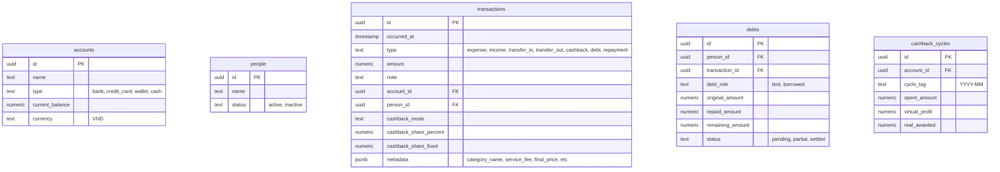

# 📘 Obsidian Money - Developer Guide & Roadmap

Welcome to the developer manual and project memory file for **Obsidian Money**. If you are a new AI agent assisting the user, please read this document first to understand the architecture, database schema, accomplishments, and roadmap.

---

## 🏗️ Project Architecture

Obsidian Money is an automated personal finance system combining:
1. **Obsidian Vault (Frontend)**: Standard Markdown logs, templates, and dynamic `dataviewjs` script blocks querying Supabase realtime.
2. **Supabase (Backend/Database)**: PostgreSQL database storing transactions, accounts, debts, and cashback cycles.
3. **Agent Daemon (Middle-tier)**: Node.js/TypeScript daemon in the `agent/` folder using:
   - `chokidar` to monitor monthly markdown logs.
   - LLMs to parse natural language inputs or Google Sheet rows pasted into `## 📥 Unsynced Transactions`.
   - Automatic account balance calculations, cashback rollup entries, and FIFO debt repayment logic.

---

## 🗄️ Supabase Database Schema

Below is the database table structures and relationships:



---

## ✅ Accomplished Features

We have completed the following core features:
1. **AI Parse & Year Inference**: AI daemon extracts natural language entries (including tab-separated sheets) and infers dates using the current log file's year context (e.g. `2025-06.md` forces DD-MM dates to resolve to 2025).
2. **Live Watcher**: Realtime file monitoring with iCloud polling enabled. Unsynced transactions are parsed, inserted into Supabase, and cleared from the log file.
3. **Recent Added Logs**: Under `## ⚡ Recent Added` in monthly logs, a dynamic DataviewJS widget renders the 5 most recently created transactions across the system.
4. **My Personal Finance Report**: A dedicated dashboard at `vault/00_Dashboard/My_Report.md` that displays **personal cashflow** cards and tables, completely excluding relationship debts and internal bank transfers.
5. **Ecosystem Page Generator**: Running `npm run generate-pages` compiles and regenerates all Account, People Index, and People Year files with unified column layouts (`Loại` styled as colored In/Out HTML tags placed before Date/Cycle columns) and correct relative folders links.

---

## 🗺️ Next Steps & Roadmap

Here are the planned features for upcoming sprints:

### 1. Connecting DBeaver (Database View Setup)
- Help the user connect a free database client (like DBeaver) to the Supabase PostgreSQL database to view tables without loading the web dashboard.
- **Connection Details**: Retrieve connection string/host details from Supabase Project Settings -> Database.

### 2. Obsidian QuickAdd setup (Modal Form & Quick Add)
- Configure the Obsidian **QuickAdd** plugin or hotkey mapping.
- Enable the user to hit a shortcut to trigger a Modal Form for quick transaction entry (which appends text to the active monthly log's `Unsynced` section).

---

## ✅ Completed: Google Sheets Sync via n8n (v1.6.0)

### Architecture
```
Supabase DB → CLI Script → n8n Webhook → Google Sheets API
                                ↓
                    Clone Template tab (if new cycle)
                                ↓
                    values:batchUpdate (disjoint ranges)
                                ↓
                    Apps Script: copy formulas, sort, borders
```

### Key Design Decisions
1. **`values:batchUpdate` with disjoint ranges**: n8n writes ONLY to columns A:C, E:H, K. Columns D (Shop VLOOKUP), I (Σ Back formula), J (Final Price formula) are NEVER written to — preserving template formulas.
2. **`responseMode: lastNode`**: Webhook serializes execution to prevent race conditions when multiple transactions are synced at once (avoids duplicate `_conflict` sheet tabs).
3. **Google Apps Script `onChange`**: Fires on ALL change types (including API writes `changeType='OTHER'`). Handles: self-healing Row 4 formulas, copying formulas to new rows, setting cell borders, sorting by date.
4. **Template-based sheet creation**: Each spreadsheet has a `Template` tab. n8n auto-clones it when a new cycle is first synced.

### Files
- `n8n/google_sheets_sync_workflow.json` — n8n workflow definition (import via `n8n/import_and_activate.py`)
- `n8n/google_apps_script.js` — Google Apps Script (must be manually pasted into the spreadsheet's Extensions → Apps Script)
- `agent/src/scripts/sync_transactions_custom.ts` — CLI reference implementation for the full sync flow
- `agent/skills/01_transaction_parsing.md` — Parsing rules, column layout, and technical reference

---

## 🤖 Instructions for the Next Assistant Session
1. **Always read `agent/skills/` first** before working with transactions or sync.
2. Check `agent/src/index.ts` to see daemon execution flow and `agent/src/scripts/generate_pages.ts` for vault pages generation.
3. Keep the styling aesthetic high: use HSL colors, modern typography, glassmorphism, and clean structures in any UI/DataviewJS edits.
4. Suppress verbose console outputs and maintain error safety for all network calls.
5. **NEVER use the n8n GSheets Append node** for writing transactions. Always use raw `values:batchUpdate` with disjoint ranges to preserve formula columns.
6. When syncing transactions, **always show a preview table** to the user before submitting.
7. **Always use `NODE_OPTIONS="--dns-result-order=ipv4first"`** when starting n8n or running scripts that call Google APIs, to avoid connection timeouts due to unroutable IPv6 addresses.
8. **Create Obsidian Account Pages for New Accounts**: Whenever a new account is registered in the database, immediately create its corresponding markdown file in `vault/02_Accounts/<Account_Name>.md` copying the template from [MoMo.md](file:///Users/rei/Github/biz-docs/vault/02_Accounts/MoMo.md) with the correct `id` in the frontmatter.

