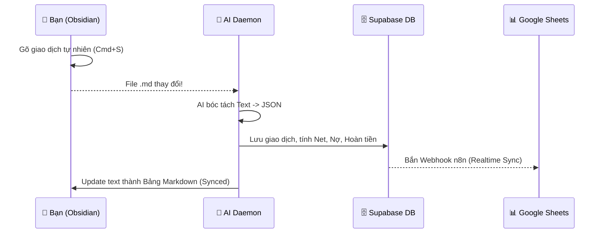

# 📘 Sổ tay Hướng dẫn Obsidian Money

Chào mừng bạn đến với hệ thống quản lý tài chính cá nhân tự động hoá bằng AI ngay trong Obsidian.

## 🗺️ Luồng hoạt động tổng quan (Workflow)



## 📝 1. Cách nhập Giao dịch cơ bản

Bạn chỉ cần mở file của tháng hiện tại (ví dụ `2026-05.md`), tìm đến mục `> [!todo] 📥 Unsynced Transactions` và gõ theo ý muốn.
**Cấu trúc tự nhiên AI có thể hiểu:**
`[Người (tuỳ chọn)] + [Nội dung] + [Số tiền] + [Hoàn tiền (tuỳ chọn)] + [Thẻ]`

**📌 Các ví dụ thực tế (Có thể Copy & Paste để test):**
- Chi tiêu bình thường: `> - ăn trưa 55k Vpbank`
- Có hoàn tiền (%): `> - mua đồ siêu thị 200k -5% Tpbank`
- Có hoàn tiền (Cố định): `> - đổ xăng 60k +10k MoMo`
- Cho vay / Mượn nợ: `> - Hương vay 500k từ Vpbank` hoặc `> - Nam trả nợ 2 triệu vào Tpbank`
- Mua hộ (Vừa Nợ vừa Hoàn tiền): `> - Lâm shopee zakka 115k -8% Tpbank`
- Chuyển tiền (Transfer): `> - chuyển 500k từ Tpbank sang MoMo`
- Thu nhập: `> - nhận lương 20 triệu vào Tpbank`

> **💡 Mẹo:** Sau khi gõ xong, bấm `Cmd + S` (Lưu file). Đợi khoảng 5-10 giây, dòng chữ của bạn sẽ tự động biến thành một bảng Markdown siêu đẹp nằm ở dưới mục `Synced Transactions`.

---

## 💳 2. Khi có Thẻ (Account) hoặc Người (People) mới thì làm sao?

Nếu bạn có thêm thẻ tín dụng mới, hoặc có thêm bạn bè mới phát sinh công nợ, bạn làm theo 2 bước cực kỳ đơn giản sau:

### Bước 1: Khai báo trên Supabase
- Truy cập Supabase Dashboard -> Table Editor.
- Vào bảng `accounts` (hoặc `people`) và bấm **Insert Row**.
- Điền tên thẻ (vd: `Techcombank`) hoặc tên người (vd: `Hải`) và lưu lại.

### Bước 2: Tự động tạo giao diện Obsidian
- Mở Terminal (trong VS Code hoặc Terminal của Mac).
- Di chuyển vào thư mục dự án: `cd /Users/rei/Library/Mobile Documents/com~apple~CloudDocs/github2026/biz-docs`
- Chạy lệnh tự động hóa:
  ```bash
  npm run generate-pages
  ```
- **Tada! 🎉** Hệ thống sẽ tự động sinh ra các file `Techcombank.md` hoặc `Hải.md` tuyệt đẹp nằm trong thư mục `02_Accounts` / `03_People`, được gắn sẵn toàn bộ các bảng Dataview thống kê!

---

## ❓ 3. Hỏi & Đáp (Q&A)

**Q: Làm sao để Edit (Sửa) hoặc Delete (Xóa) một giao dịch đã đồng bộ?**
**A:** Hiện tại luồng nhập liệu là luồng một chiều (Obsidian -> Supabase). Vì mỗi giao dịch liên quan mật thiết đến Số dư thẻ, Công nợ FIFO, và Hoàn tiền, nên nếu bạn muốn Sửa/Xóa, **bạn phải thao tác trực tiếp trên Supabase Dashboard** (Xoá dòng trong bảng `transactions`, `debts`). 
*(Ghi chú: Việc Sửa/Xóa trực tiếp trên Obsidian sẽ được phát triển ở Sprint 7 bằng công cụ Modal Form chuyên dụng).*

**Q: Khi xem trang của 1 Người (ví dụ `Lâm.md`), làm sao để tôi xem chi tiết giao dịch của tháng đó?**
**A:** Trong bảng "Tình trạng Công nợ" và "Giao dịch", bạn sẽ thấy cột **Tháng** có chứa link (ví dụ `[[2026-05]]`). Khi bấm vào, nó sẽ mở file gốc của tháng đó. Thay vì tạo hàng trăm folder con chia nhỏ cho từng người `Lâm/2026-05`, chúng ta sử dụng Dataview để gộp chung! 
*(Ghi chú: Nếu bạn muốn lọc sâu hơn, bạn có thể gõ vào thanh Search của Obsidian: `file:2026-05 Lâm` để xem dòng highlight).*
